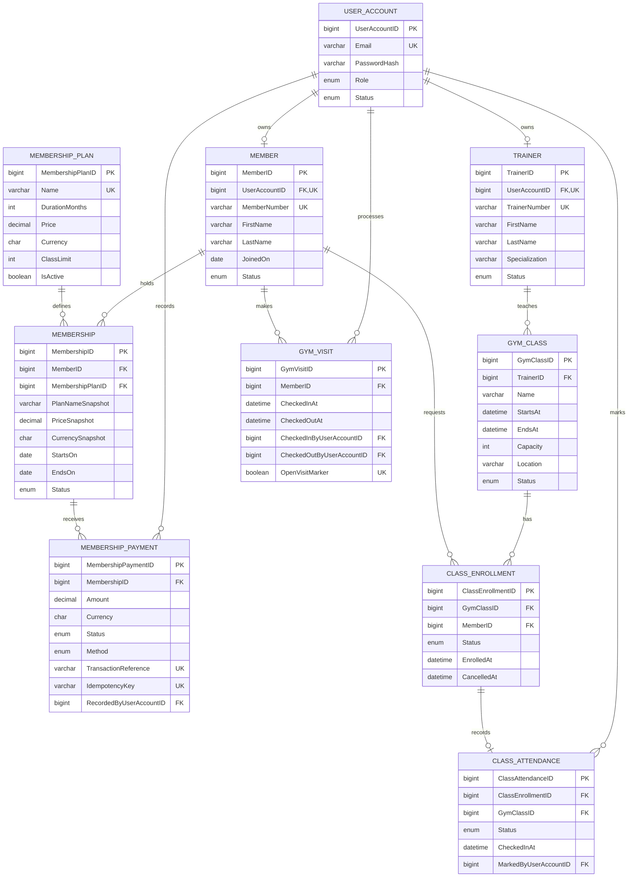

# Entity relationship diagram

`CLASS_ATTENDANCE` uses a composite foreign key (`ClassEnrollmentID`, `GymClassID`) so an attendance record cannot name a different class from its enrollment. Administrative and receptionist accounts have no profile row. Member and trainer profiles reference their account, preserving one authentication table without exceeding the ten-business-table boundary.
